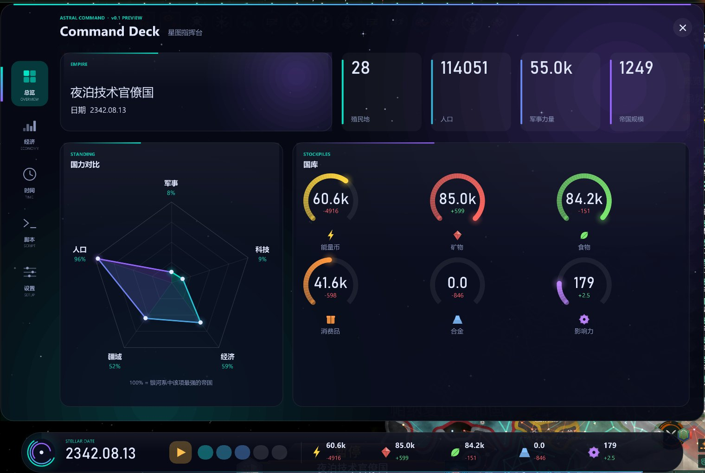
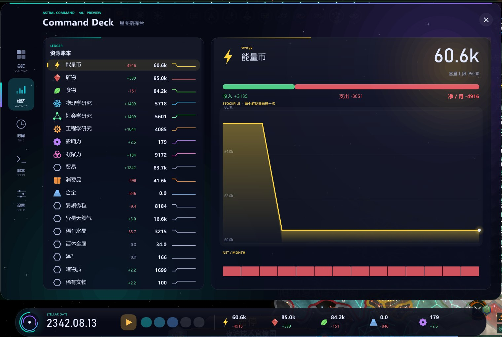
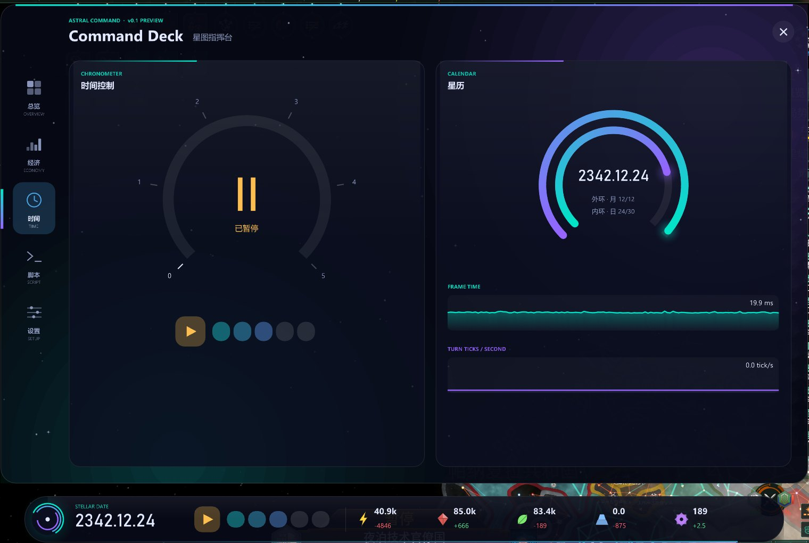
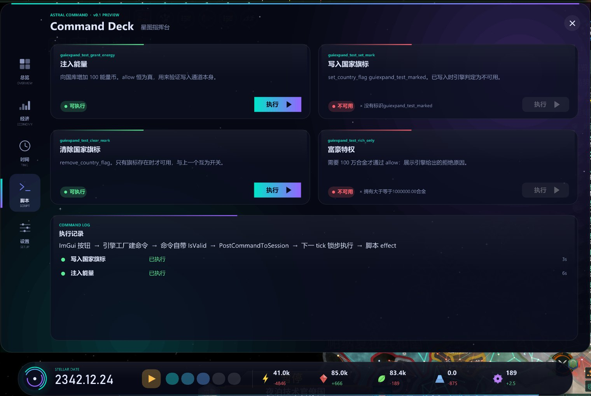

# stellaris-argon-ui

[English](README.md) | [简体中文](README.zh-CN.md)

**Stellaris 4.5.2** 的组件库，像网页里的 Element 或 Vuetify：卡片、分列、环形仪表、雷达图、面积图、资源账本、标签页、HUD 胶囊等等，由 **mod** 在文本文件里直接使用。
不需要 DLL，不需要编程。

它是 [stellaris-guiexpand](https://github.com/Yidhar/stellaris-guiexpand)（用引擎自带的 Dear ImGui 在游戏里画面板的宿主）的一个插件。宿主从 mod 的
`interface/stl_gui/*.txt` 读取面板；这个插件提供那些文件里可以写的元素：

```
argon_card = {
    kicker  = MYMOD_KICKER
    title   = MYMOD_ENERGY
    content = { argon_chart = { series = energy  height = 140 } }
}
```

图里的 *Command Deck*（一个状态胶囊加一个五页的窗口）就是用这个库写的，**只有两个文本文件和一个本地化文件**
（[`examples/command-deck`](examples/command-deck)）。



| 经济 | 时间 | 脚本 |
|---|---|---|
|  |  |  |

## 有什么

27 个组件，都叫 `argon_*`；每个的参数见 [docs/components.zh-CN.md](docs/components.zh-CN.md)（[English](docs/components.md)）。

| | |
|---|---|
| **布局** | `argon_card`、`argon_row`（配 `col`）、`argon_gap`、`argon_window`、`argon_tabs` |
| **数据** | `argon_stat_tile`、`argon_ring`、`argon_radar`、`argon_chart`、`argon_spark`、`argon_icon`、`argon_heading`、`argon_ledger`、`argon_resource_detail`、`argon_calendar` |
| **时间与脚本** | `argon_speed_dial`、`argon_effect_card`、`argon_effect_log` |
| **设置** | `argon_theme_picker`、`argon_switch`、`argon_info` |
| **HUD 胶囊** | `argon_pill`、`argon_orb`、`argon_date`、`argon_speed`、`argon_vline`、`argon_chip` |

它们跟随玩家的主题（四套配色）、屏幕的布局缩放和游戏的语言，用宿主提供的数据绘制（资源和它们的历史、日期、速度、帝国的各项数字），所以 mod 自己什么都不用读。

没有装这个插件时，用了它的 mod 照样能加载：每个 `argon_*` 条目显示一行暗色提示，写明缺哪个插件，面板的其余部分照常绘制。

## 安装和使用

需要 **stellaris-guiexpand**（带元素和 HUD 面板的版本，0.1.0 或更新）和会加载插件的 **Stellaris 启动器**。

1. 从 [Releases](https://github.com/Yidhar/stellaris-argon-ui/releases) 下载 `stellaris-argon-ui-v<版本>.zip`（旁边有 `.sha256`）。
2. 解压到 `Documents\Paradox Interactive\Stellaris\plugins\stellaris-argon-ui\`（zip 没有顶层文件夹：`stl-plugin.json` 直接在里面），或者解压到任意位置，用
   `stl plugin install <文件夹>` 安装。
3. 在播放集里和 stellaris-guiexpand 一起启用（`stl plugin enable stellaris-argon-ui`）。顺序无所谓：这个插件会等宿主。
4. 用启动器启动游戏。

想看效果就用 `stellaris-argon-ui-samples-v<版本>.zip`（或 [`examples/`](examples)）里的 mod：`python tools/mod_install.py install deck` 把 Command Deck 复制到你的 mod 文件夹并启用
（`demo` 是那个展示组件的小面板）。Deck 的脚本页运行
[stellaris-guiexpand-test-mod](https://github.com/Yidhar/stellaris-guiexpand-test-mod) 里的 effect，要用那四张卡片就也启用它。进入游戏后，胶囊在屏幕底部；
点它的圆环或按 **Ctrl + Alt + G** 打开 Deck。`python tools/mod_install.py uninstall all` 把示例 mod 去掉。

## 给 mod 作者

按[宿主的指南](https://github.com/Yidhar/stellaris-guiexpand/blob/main/docs/mod-authors.zh-CN.md)写面板，用 [docs/components.zh-CN.md](docs/components.zh-CN.md) 里的组件。
文件里加一行 `stl_gui_requires = { stellaris-argon-ui }`，没装插件的玩家就会被告知该装什么。

## 兼容性

- 它只用 stellaris-guiexpand 的**公共 C 接口**，不读引擎内存，所以**不依赖游戏版本**；依赖游戏版本的是宿主。游戏更新后要更新的是宿主，不是这个库。
- `include/stellaris_guiexpand/` 里的接口头文件是宿主那份的副本。`python tools/sync_interface.py <宿主仓库>` 更新它们，`--check` 检查是否一致。
- 宿主太旧、不支持元素时会被检测到并写日志（插件文件夹里的 `logs\stellaris_argon_ui.log`），此时什么都不画。

## 仓库里有什么

```
src/               argon.cpp（插件本体：找到宿主、注册组件）、draw.*（绘制辅助）、components*.cpp（各个组件）
include/           宿主的接口头文件（副本）
plugin/            stl-plugin.json
examples/          demo-mod（组件展示面板）、command-deck（Command Deck 这个 mod）
docs/              components.md（有 .zh-CN.md 中文版）和图片
tools/             build.bat、check_plugin.py、sync_interface.py、mod_install.py、live/argon_test.py（作者的实机驱动）
```

## 构建

Visual Studio 2022（x64）和 CMake 3.20。Dear ImGui 1.85 由 CMake 获取：插件用自己的一份来绘制，通过宿主绑定到引擎的上下文。

```
tools\build.bat [path\to\vcvars64.bat]     # -> build\plugin\stellaris-argon-ui
python tools\check_plugin.py --dir build\plugin\stellaris-argon-ui
```

## 许可

MIT，见 [LICENSE](LICENSE)。
