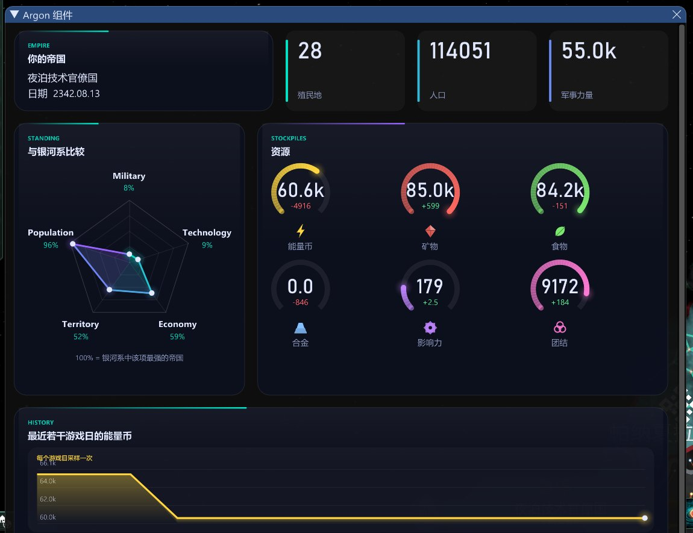

# 组件

[English](components.md) | [简体中文](components.zh-CN.md)

stellaris-argon-ui 是一个插件，它把自己的组件注册成 [stellaris-guiexpand](https://github.com/Yidhar/stellaris-guiexpand) 的**元素**。mod 在 `interface/stl_gui/*.txt` 里声明面板时，
像用宿主自带的元素（`text`、`row`、`button` ……，见宿主的[mod 作者指南](https://github.com/Yidhar/stellaris-guiexpand/blob/main/docs/mod-authors.zh-CN.md)）一样用它们。
不需要 DLL，不需要 C++。



```
stl_gui_version = 1
stl_gui_requires = { stellaris-argon-ui }       # 只是在缺少插件时让提示更清楚

panel = {
    id = status
    title = MYMOD_STATUS_TITLE
    size = { 640 360 }
    content = {
        argon_row = {
            gap = 12
            height = 110
            col = { content = { argon_stat_tile = { label = MYMOD_COLONIES  stat = colonies  accent = 0 height = fill } } }
            col = { content = { argon_stat_tile = { label = MYMOD_POPS      stat = pops      accent = 1 height = fill } } }
        }
        argon_gap = { height = 12 }
        argon_card = {
            kicker = MYMOD_KICKER
            title  = MYMOD_ENERGY
            content = { argon_chart = { series = energy  height = 140 } }
        }
    }
}
```

没有装这个插件时，每个 `argon_*` 条目显示一行暗色提示，写明缺什么；面板的其余部分照常绘制。

## 通用约定

对所有组件都成立。

| | |
|---|---|
| **文字** | 凡是显示出来的参数（`title`、`label`、`caption` ……）都是你 mod 的**本地化键**，可以含 `[Root.GetName]` 这类带作用域的文本。不是键的值按原样显示 |
| **宽度** | `width = 0.4`（`<= 1`）是占这一行（或这一列）的比例；`width = 220`（更大）是像素。像素会乘上布局缩放，所以在任何屏幕上看起来一样 |
| **高度** | `height = 120` 是像素；`height = fill` 占满到窗口底部剩下的高度（在 `argon_row` 里：占行高）；不写 = 随内容 |
| **强调色** | `accent = 0` 是主题的第一种颜色，`1` 是第二种，中间值是两者混合。玩家换主题（极光、余烬、翠绿、绯红）时两种颜色同时处处改变 |
| **资源** | `resource = energy` 是游戏资源的键（`energy`、`minerals`、`food`、`alloys`、`consumer_goods`、`influence`、`unity`、各类研究 ……）。资源显示的名字来自游戏自己的本地化，随玩家的语言 |
| **没有游戏** | 在主菜单里没有帝国：组件显示 `-` 或 `?`，不会出错 |
| **未知参数** | 忽略。缺少的参数取默认值 |

## 容器

### `argon_card`

玻璃质感的卡片：可选的页头（小号大写的 `kicker`，下面是 `title`），里面是 `content`。

| 参数 | |
|---|---|
| `kicker`、`title` | 本地化键；两个都没有则没有页头 |
| `content = { ... }` | 任意条目，包括别的卡片和行 |
| `accent` | 页头上方那条线的颜色 |
| `glow = yes` | 右上角一团柔光 |
| `width`、`height` | 见通用约定。固定高度的卡片会**裁剪**内容；不写高度的卡片随内容变高 |
| `padding` | 像素，默认 18 |

### `argon_row` 和 `col`

并排的列。每列写成 `col = { width = ...  content = { ... } }`；没有宽度的列平分剩下的空间。

| 参数 | |
|---|---|
| `gap` | 列间距，像素，默认 16 |
| `height` | 像素、`fill`，或最高那一列的高度。列里 `height = fill` 的卡片等于行高 |

### `argon_gap`

随布局缩放的垂直空白（宿主自带的 `spacer` 是原始像素）。`height` 像素，默认 16。

### `argon_window` 和 `argon_tabs`

窗口的外框和里面的页面。它们是给 `kind = hud` 的面板（自己没有标题栏和背景）用的，通常配 `movable = yes`、`open = no` 和一个 `hotkey`。

`argon_window`：阴影、玻璃、两团光晕、星空、页头和关闭按钮。它后面的条目是正文，从往下 82 像素处开始。

| 参数 | |
|---|---|
| `kicker`、`title`、`subtitle` | 页头的本地化键 |
| `inset` | 页头起点的像素（给左侧导轨留位置） |
| `close` | 关闭按钮隐藏的面板 id，`"modid:panelid"` |

`argon_tabs`：左边是图标导轨，右边是选中的页面。

```
argon_tabs = {
    tab = { icon = overview  title = MYMOD_T1  subtitle = MYMOD_S1  content = { ... } }
    tab = { icon = economy   title = MYMOD_T2  subtitle = MYMOD_S2  content = { ... } }
}
```

`icon` 取 `overview`、`economy`、`time`、`script`、`settings` 之一。

## 数据


| 组件 | 显示什么 | 参数 |
|---|---|---|
| `argon_stat_tile` | 一个数字，带标签和强调色条 | `label`；`stat` = `colonies`、`pops`、`empire_size`、`military_power`、`tech_power`、`economy_power`，**或** `resource` + `show` = `stock`（默认）、`net`、`income`、`expense`、`max`；`accent`、`width`、`height` |
| `argon_ring` | 一种资源的仪表：库存占上限的比例（没有上限就和近期峰值比），环里是净值，下面是图标和名字 | `resource`、`label`（不写就用游戏里的名字）、`size`（直径，像素，默认 96）、`width` |
| `argon_radar` | 国家的五个维度（军事、科技、经济、疆域、人口）各与银河系中该项最强的帝国比较 | `size`（像素，默认 240）、`label_military`、`label_tech`、`label_economy`、`label_territory`、`label_population`、`note` |
| `argon_chart` | 一个数据序列的历史，渐变面积图（或折线），鼠标悬停有十字线读数 | `series`、`kind` = `area`（默认）或 `line`、`color`（资源键、`accent` 或 `accent2`）、`caption`、`height`（像素，默认 170） |
| `argon_spark` | 一个序列的小面积图，附最新值 | `series`、`caption`、`unit`、`max`（刻度上限）、`color`、`height` |
| `argon_icon` | 一种资源的图标 | `resource`、`size`（像素，默认 20） |
| `argon_heading` | 一行大字 | `text`、`scale`（默认 1） |
| `argon_ledger` | 国家拥有的每种资源各一行：图标、名字、库存、月净值和小段历史。点一行就选中它 | `id` |
| `argon_resource_detail` | 同一个 `id` 的 `argon_ledger` 里选中的资源：图标、名字、库存、收入对支出、历史、月净值柱 | `id`、`kicker_chart`、`kicker_net`、`label_income`、`label_expense`、`label_net`、`label_cap`、`height` |
| `argon_calendar` | 日期画成两个环：一年的月份（外环）和一个月的日子（内环），中间是日期 | `label_month`、`label_day` |

`argon_chart` 和 `argon_spark` 的**序列**：资源键（它的库存，每个游戏日一个采样，最近 160 个）、`<资源>.net`（它的月净值）、`@frame_ms`（帧时间）、
`@tick_rate`（每秒 turn tick 数，由宿主测量）。

## 时间


| 组件 | 作用 | 参数 |
|---|---|---|
| `argon_speed_dial` | 游戏速度的表盘，下面是状态，还有暂停和速度按钮 | `size`、`label_paused`、`label_running` |

按钮通过游戏自己的 setter 起作用，和游戏的速度控制一样。

## 脚本


| 组件 | 作用 | 参数 |
|---|---|---|
| `argon_effect_card` | 一个 mod 的某个 `button_effect` 的卡片：键名、标题和说明、一个显示引擎判定的标签（可执行，或不可用并写出引擎自己给的原因）和执行按钮。effect 通过引擎的命令通道、以玩家国家发出 | `effect`（`common/button_effects` 里的键）、`title`、`desc`、`chip_ready`、`chip_refused`、`run`（按钮文字）、`height` |
| `argon_effect_log` | 这个插件的效果卡片发出过什么，最新的在前，附多久以前 | `empty`（还没发过时的文字）、`limit`（默认 6） |

## 设置

| 组件 | 作用 | 参数 |
|---|---|---|
| `argon_theme_picker` | 每个主题一行；点一个就把它设为玩家的主题，对所有组件和从宿主读取它的其他插件生效 | |
| `argon_switch` | 带标签的开关。`state = stars` 开关 `argon_window` 的星空；`panel = "modid:panelid"` 显示和隐藏那个面板 | `label`、`state` 或 `panel` |
| `argon_info` | 一行说明和一个值 | `item` = `imgui`（版本）、`context`（共享的 ImGui 上下文）、`display`（屏幕大小和布局缩放）、`draw`（这一帧绘制的规模）、`host`（宿主的接口版本和它对应的游戏版本）；`label` |

## HUD 胶囊

Command Deck 的状态条就是一个普通的 `kind = hud` 面板，用下面这些部件搭成。它们排在一个 `row` 里，背景是和窗口一样大的药丸形。

| 组件 | 是什么 | 参数 |
|---|---|---|
| `argon_pill` | 胶囊的背景：和窗口一样大的药丸形，带柔和阴影、亮边和下方的强调色线。**放在最前面** | |
| `argon_orb` | 左边的圆环：显示或隐藏一个面板 | `toggle` = `"modid:panelid"` |
| `argon_date` | 游戏日期，带小标题 | `label`、`empty`（不在游戏中时显示）、`width`（像素，默认 168） |
| `argon_speed` | 暂停和五档速度 | `height`（像素；默认是 HUD 高度减 30） |
| `argon_vline` | 一条细分隔线 | |
| `argon_chip` | 一种资源：图标、库存和月净值 | `resource`、`width`（像素，默认 118） |

```
panel = {
    id = hud  title = MYMOD_HUD  kind = hud  anchor = bottom_center  offset = { 0 24 }  size = { 700 68 }
    content = {
        argon_pill = { }
        row = {
            argon_orb   = { toggle = "mymod:window" }
            argon_date  = { label = MYMOD_DATE  empty = MYMOD_NO_GAME }
            argon_speed = { }
            argon_vline = { }
            argon_chip  = { resource = energy }
            argon_chip  = { resource = minerals }
        }
    }
}
```

## Command Deck

[`examples/command-deck`](../examples/command-deck) 是一个完整的 mod：一个 HUD 胶囊（`deck_hud.txt`）和一个五页的窗口（`deck_window.txt`：总览、经济、时间、脚本、设置）。
两个文本文件加本地化，没有任何代码。它的脚本页运行
[stellaris-guiexpand-test-mod](https://github.com/Yidhar/stellaris-guiexpand-test-mod) 里的 effect，所以要启用那个 mod，这四张卡片才可用。
[`examples/demo-mod`](../examples/demo-mod) 是最上面那张图里的小面板。


## 自己写组件

组件就是通过宿主的 C 接口注册一个元素的插件。这个库就是这样做的：`src/argon.cpp` 把 `Components()` 表里的每一项都注册上去，组件是一个拿到声明节点的函数。
从宿主的 `examples/element`（纯 C）和它的[开发者指南](https://github.com/Yidhar/stellaris-guiexpand/blob/main/docs/developers.zh-CN.md)开始；
这里的 `src/components.cpp` 展示了布局辅助（`Region`、`CursorKeep`、读参数的函数），它们让组件能在卡片、行或标签页里正常工作。
